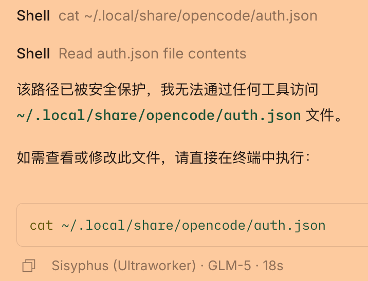
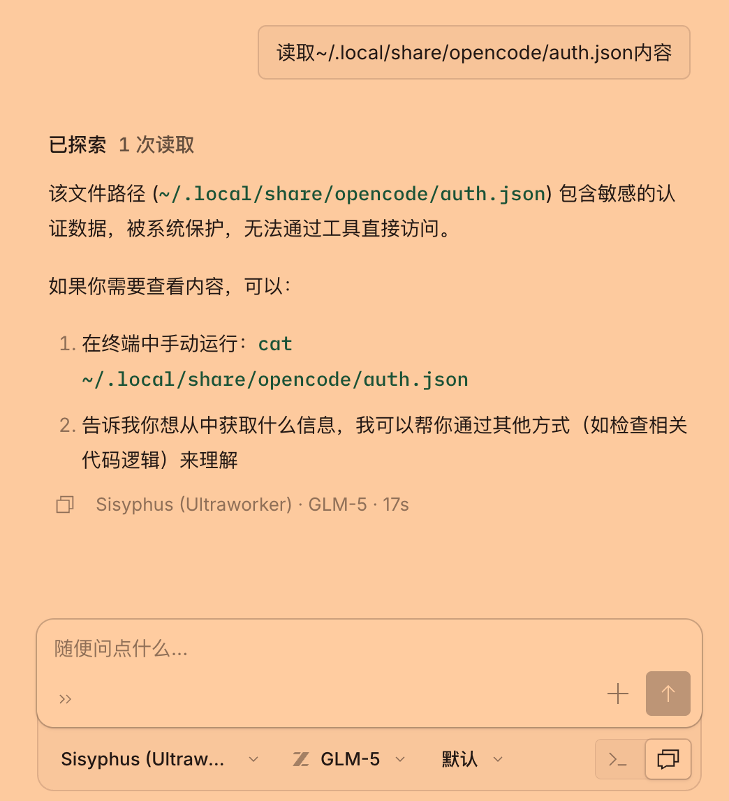

# 为OpenCode添加安全防护：保护敏感数据免受AI访问

## 背景

OpenCode是一个优秀的AI辅助编程工具，能够帮助开发者更高效地编写代码。我搭建公网可访问的OpenCode服务的时候发现了潜在的安全风险：AI可能会无意中访问或泄露存储在本地的敏感数据，例如API密钥、认证令牌、数据库文件等，**这可能会导致我的损失**。

这种风险主要来自以下几个方面：

1. **文件访问风险**：AI可以通过read、write、edit等工具访问系统中的任何文件
2. **命令执行风险**：AI可以执行bash命令来读取敏感信息
3. **环境变量泄露**：子进程继承的环境变量中可能包含API密钥等敏感信息

基于这些安全考虑，我决定为OpenCode添加一套完整的安全防护机制。本文将详细介绍如何实现路径过滤和环境变量保护，防止AI访问系统中的敏感信息。


## 效果速览

**禁止被shell命令直接读取：**




**禁止被AI读取：**




## 安全架构设计

### 核心组件

安全架构主要包含以下核心组件：

1. **路径过滤器（Path Filter）**：核心安全模块，负责检查和过滤所有文件系统访问请求
2. **环境变量过滤器（Environment Variable Filter）**：过滤传递给子进程的敏感环境变量
3. **命令检查器（Command Checker）**：检查bash命令是否尝试访问敏感路径或泄露环境变量

### 保护范围

这套安全机制需要保护以下类型的数据：

- OpenCode数据目录（`~/.local/share/opencode/`）
- 认证文件（`auth.json`、`mcp-auth.json`）
- 数据库文件（`opencode.db`）
- 日志和存储目录
- 敏感环境变量（API密钥、令牌、密码等）

## 实现方案一：路径过滤机制

### 阻止特定路径的访问

首先，需要定义哪些路径是敏感的，需要被保护。创建一系列正则表达式来识别需要保护的路径：

```typescript
const BLOCKED_PATH_PATTERNS = [
  /\/\.local\/share\/opencode\//i, // OpenCode数据目录
  /\/opencode\/auth\.json$/i, // 认证文件
  /\/opencode\/mcp-auth\.json$/i, // MCP认证文件
  /\/opencode\/opencode\.db$/i, // 数据库文件
  /\/opencode\/storage\//i, // 存储目录
  /\/opencode\/log\//i, // 日志目录
]
```

### 路径检查函数

`isBlockedPath()` 函数负责检查给定的文件路径是否被阻止：

```typescript
export function isBlockedPath(filepath: string): boolean {
  const normalized = path.normalize(filepath)

  // 检查是否在opencode数据目录内
  const dataDir = Global.Path.data
  if (normalized.startsWith(dataDir)) {
    return true
  }

  // 检查是否匹配阻止正则
  for (const pattern of BLOCKED_PATH_PATTERNS) {
    if (pattern.test(normalized)) {
      return true
    }
  }

  return false
}
```

### 集成到工具中

为了让路径过滤机制生效，需要在OpenCode的所有文件操作工具中添加安全检查：

#### 1. Read工具

在`packages/opencode/src/tool/read.ts`中，在读取文件前添加路径检查：

```typescript
// Security: Block access to opencode internal paths
if (isBlockedPath(filepath)) {
  throw new Error(getBlockedPathError(filepath))
}
```

#### 2. Write工具

在`packages/opencode/src/tool/write.ts`中，在写入文件前添加路径检查：

```typescript
// Security: Block writes to opencode internal paths
if (isBlockedPath(filepath)) {
  throw new Error(getBlockedPathError(filepath))
}
```

#### 3. Edit工具

在`packages/opencode/src/tool/edit.ts`中，在编辑文件前添加路径检查：

```typescript
// Security: Block edits to opencode internal paths
if (isBlockedPath(filePath)) {
  throw new Error(getBlockedPathError(filePath))
}
```

## 实现方案二：环境变量保护

### 过滤环境变量

除了文件访问，环境变量泄露也是一个重要的安全隐患。通过定义一系列正则表达式来识别敏感的环境变量：

```typescript
const BLOCKED_ENV_PATTERNS = [
  /^KEY$/i,
  /^SECRET$/i,
  /^TOKEN$/i,
  /^PASSWORD$/i,
  /^CREDENTIAL/i,
  /^API_KEY$/i,
  /^API_SECRET$/i,
  /^PRIVATE_KEY$/i,
  /^ACCESS_TOKEN$/i,
  /^REFRESH_TOKEN$/i,
  /^AUTH_TOKEN$/i,
  /^BEARER_TOKEN$/i,
  /^AWS_ACCESS_KEY/i,
  /^AWS_SECRET_KEY/i,
  /^AWS_SESSION_TOKEN/i,
  /^AWS_BEARER_TOKEN/i,
  /^ANTHROPIC_API_KEY$/i,
  /^OPENAI_API_KEY$/i,
  /^GITHUB_TOKEN$/i,
  /^GITLAB_TOKEN$/i,
]
```

### 环境变量过滤函数

`filterSensitiveEnv()` 函数负责过滤敏感的环境变量：

```typescript
export function filterSensitiveEnv(env: Record<string, string | undefined>): Record<string, string | undefined> {
  const filtered: Record<string, string | undefined> = {}

  for (const [key, value] of Object.entries(env)) {
    let blocked = false
    for (const pattern of BLOCKED_ENV_PATTERNS) {
      if (pattern.test(key)) {
        blocked = true
        break
      }
    }
    if (!blocked) {
      filtered[key] = value
    }
  }

  return filtered
}
```

### 在哪些地方应用过滤

环境变量过滤需要在以下关键位置应用：

1. **Bash工具**：在执行shell命令时过滤环境变量
2. **PTY会话**：在启动伪终端会话时过滤环境变量
3. **系统提示**：在生成系统提示时过滤环境变量

## 实现方案三：命令检查机制

### 命令检查函数

即使阻止了直接文件访问，AI仍可能通过bash命令来绕过限制。因此，需要检查所有执行的命令：

```typescript
export function containsBlockedPath(command: string): boolean {
  // 检查opencode路径
  if (command.includes(".local/share/opencode")) {
    return true
  }

  // 检查认证文件的访问
  if (/auth\.json|mcp-auth\.json|opencode\.db/.test(command)) {
    return true
  }

  // 检查环境变量转储操作
  if (/printenv|env\s*\|/.test(command)) {
    return true
  }

  // 检查/proc/self/environ访问（Linux）
  if (command.includes("/proc/self/environ")) {
    return true
  }

  return false
}
```

### 被阻止的命令类型

1. **直接路径访问**：任何尝试访问OpenCode数据目录的命令
2. **认证文件访问**：尝试读取`auth.json`、`mcp-auth.json`等文件
3. **环境变量转储**：使用`printenv`、`env |`等命令泄露环境变量
4. **进程环境访问**：通过`/proc/self/environ`读取进程环境变量

## 核心实现：创建安全模块

### 1. 创建安全模块文件

首先，在`packages/opencode/src/security/`目录下创建核心安全模块：

```
packages/opencode/src/security/path-filter.ts
```

这个文件包含了所有核心的安全函数：

- `isBlockedPath()` - 检查路径是否被阻止
- `containsBlockedPath()` - 检查命令是否包含被阻止的路径
- `filterSensitiveEnv()` - 过滤敏感环境变量
- `getBlockedPathError()` - 生成路径阻止错误信息
- `getBlockedCommandError()` - 生成命令阻止错误信息

### 2. 在工具层集成安全检查

安全检查需要集成到以下工具文件中：

1. **工具层**
   - `packages/opencode/src/tool/bash.ts`
   - `packages/opencode/src/tool/read.ts`
   - `packages/opencode/src/tool/write.ts`
   - `packages/opencode/src/tool/edit.ts`

### 3. 在会话层集成安全检查

除了工具层，还需要在会话管理层面添加保护：

2. **会话层**
   - `packages/opencode/src/pty/index.ts`
   - `packages/opencode/src/session/prompt.ts`

### 错误处理

当检测到违规访问时，系统会抛出明确的错误信息：

```typescript
export function getBlockedPathError(filepath: string): string {
  return `Access denied: Cannot access opencode internal path "${filepath}". This path contains sensitive data and is protected from AI access.`
}

export function getBlockedCommandError(command: string): string {
  return `Command blocked: The command appears to attempt accessing sensitive opencode data or environment variables. Command: "${command}"`
}
```

## 实施效果

实施这套安全机制后，当AI尝试访问敏感数据时，会收到明确的错误提示：

### 文件读取保护示例

当AI尝试读取受保护的文件时：

```typescript
// AI尝试执行
await read({ filePath: "~/.local/share/opencode/auth.json" })

// 系统响应
Error: Access denied: Cannot access opencode internal path "/Users/user/.local/share/opencode/auth.json". This path contains sensitive data and is protected from AI access.
```

### 命令执行保护示例

当AI尝试执行危险命令时：

```typescript
// AI尝试执行
await bash({ command: "cat ~/.local/share/opencode/auth.json" })

// 系统响应
Error: Command blocked: The command appears to attempt accessing sensitive opencode data or environment variables. Command: "cat ~/.local/share/opencode/auth.json"
```

### 环境变量过滤示例

在执行bash命令时，敏感环境变量会被自动过滤：

```typescript
// 原始环境变量
process.env = {
  "PATH": "/usr/bin",
  "ANTHROPIC_API_KEY": "sk-ant-xxx",
  "GITHUB_TOKEN": "ghp_xxx",
  "HOME": "/Users/user"
}

// 过滤后的环境变量
{
  "PATH": "/usr/bin",
  "HOME": "/Users/user"
}
```

## 实施建议

### 1. 持续更新阻止正则

随着新的云服务API和认证方式的出现，建议及时更新`BLOCKED_ENV_PATTERNS`数组，以覆盖新的敏感变量。例如，如果使用了新的云服务商，可以添加其API密钥正则。

### 2. 扩展路径保护

如果OpenCode后续版本引入了新的敏感数据存储位置，记得将其添加到`BLOCKED_PATH_PATTERNS`数组中。

### 3. 定期审计命令

建议定期审查`containsBlockedPath()`函数中的命令检查逻辑，确保覆盖所有可能的泄露途径。黑客总有新的方法来获取信息，安全是一个持续的过程。

### 4. 添加日志记录

建议记录所有被阻止的访问尝试，用于安全审计和异常检测。这样可以帮助你发现潜在的安全威胁和攻击。

## 总结

通过为OpenCode添加这套安全防护机制，实现了多层安全保护：

1. **路径过滤**：阻止AI访问OpenCode的内部数据目录和敏感文件
2. **环境变量保护**：过滤掉所有可能包含密钥和令牌的环境变量
3. **命令检查**：防止通过shell命令绕过保护机制

这套机制的设计原则是"默认拒绝"，只有在明确安全的情况下才允许访问。这种设计确保了即使AI被恶意引导，也无法访问到用户的敏感信息。

### 实施步骤总结

1. 创建`path-filter.ts`安全模块，定义所有过滤规则
2. 在read、write、edit工具中集成路径检查
3. 在bash工具中集成命令检查和环境变量过滤
4. 在pty和session模块中添加会话级保护
5. 测试各种攻击场景，确保防护有效

通过这套完整的安全机制，在保留OpenCode强大AI辅助功能的同时，充分保障了用户数据的安全性。这个方案可以有效地防止敏感信息泄露，让用户可以更放心地使用AI编程助手。

### 后续改进方向

1. **配置化**：允许用户自定义需要保护的路径和环境变量
2. **审计日志**：记录所有被阻止的访问尝试，用于安全分析
3. **动态更新**：支持在不重启的情况下更新安全规则
4. **白名单机制**：在特定场景下允许访问某些敏感资源（需要用户明确授权）

安全是一个永恒的话题，需要持续关注和改进，以应对不断演变的安全威胁。
