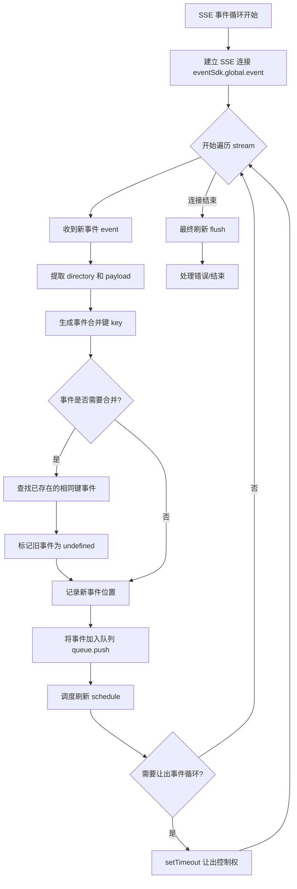
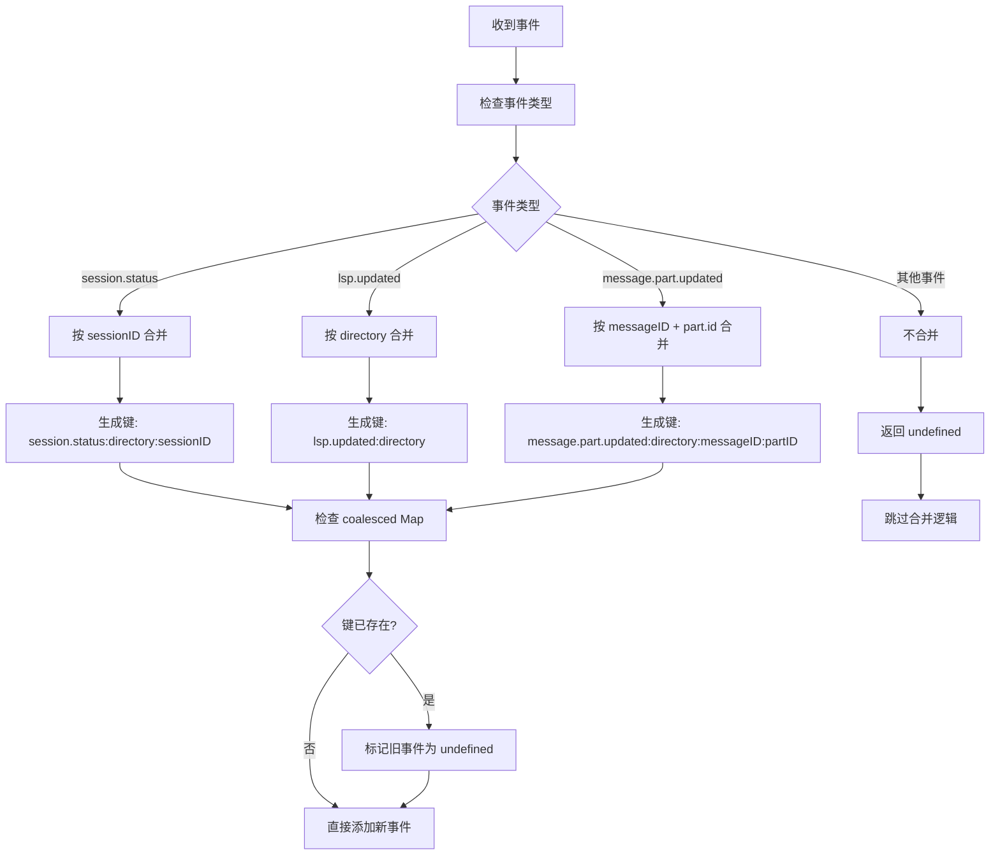
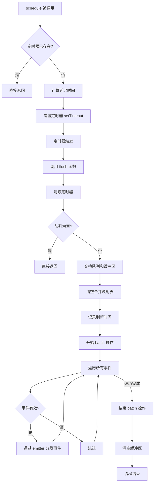
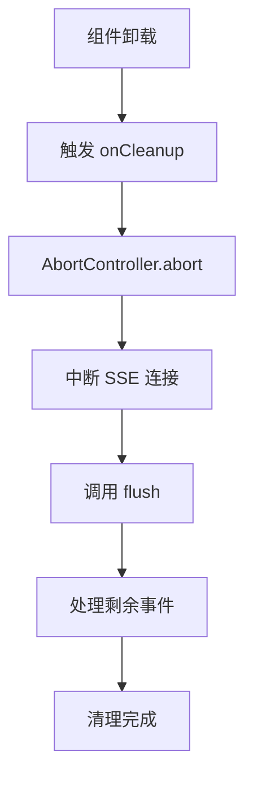

# GlobalSDKProvider 代码分析文档

## 概述

`GlobalSDKProvider` 是 OpenCode 应用中最核心的 Provider 之一，负责管理全局的 SDK 客户端和服务器发送事件（SSE）连接。它提供了统一的 API 客户端和实时事件分发机制。


## 总体架构图

```text
┌─────────────────────────────────────────────────────────────────────────┐
│                        GlobalSDKProvider                                 │
│                                                                         │
│  ┌─────────────────────────────────────────────────────────────────┐   │
│  │                      createSimpleContext                        │   │
│  │                                                                 │   │
│  │  init() {                                                      │   │
│  │    ├─ 1. 获取依赖 (server, platform)                            │   │
│  │    ├─ 2. 创建 SSE 客户端 (eventSdk)                            │   │
│  │    ├─ 3. 创建全局事件发射器 (emitter)                          │   │
│  │    ├─ 4. 初始化事件队列系统                                     │   │
│  │    │    ├─ queue/buffer: 双缓冲队列                             │   │
│  │    │    ├─ coalesced: 合并事件映射表                           │   │
│  │    │    └─ timer: 刷新定时器                                   │   │
│  │    ├─ 5. 启动 SSE 事件循环                                     │   │
│  │    ├─ 6. 创建 API 客户端 (sdk)                                 │   │
│  │    └─ 7. 设置清理函数                                         │   │
│  │  }                                                              │   │
│  └─────────────────────────────────────────────────────────────────┘   │
└─────────────────────────────────────────────────────────────────────────┘
```


## 详细执行流程

### 1. 初始化阶段 (Initialization)

```Mermaid
flowchart TD
    A[GlobalSDKProvider 创建] --> B[调用 init 函数]
    
    B --> C[获取依赖项]
    C --> D[useServer<br/>获取服务器配置]
    C --> E[usePlatform<br/>获取平台功能]
    
    D --> F[创建 AbortController]
    E --> F
    
    F --> G[创建 SSE 客户端 eventSdk]
    G --> H[创建全局事件发射器 emitter]
    
    H --> I[初始化队列系统]
    subgraph I [队列系统初始化]
        direction LR
        I1[queue: 事件队列]
        I2[buffer: 双缓冲区]
        I3[coalesced: 合并映射]
        I4[timer: undefined]
        I5[last: 0]
    end
    
    I --> J[定义内部函数]
    subgraph J [内部函数定义]
        direction LR
        J1[key函数]
        J2[flush函数]
        J3[schedule函数]
    end
    
    J --> K[启动 SSE 事件循环]
    K --> L[创建 API 客户端 sdk]
    
    L --> M[设置清理函数 onCleanup]
    M --> N[返回上下文对象]
    
    subgraph N [返回对象结构]
        direction LR
        N1[url]
        N2[client]
        N3[event]
    end
```


### 2. SSE 事件循环流程 (SSE Event Loop)




### 3. 事件合并逻辑 (Event Coalescing)




### 4. 事件刷新流程 (Flush Process)




### 5. 清理流程 (Cleanup)




## 关键数据结构

typescript

```typescript
// 事件队列系统
let queue: Array<Queued | undefined> = []      // 当前处理队列
let buffer: Array<Queued | undefined> = []     // 双缓冲区
const coalesced = new Map<string, number>()   // 合并事件映射
let timer: ReturnType<typeof setTimeout> | undefined  // 刷新定时器
let last = 0                                   // 上次刷新时间戳

// 事件类型
type Queued = {
  directory: string  // 项目目录
  payload: Event     // 事件负载
}

// 返回对象
return {
  url: server.url,           // 服务器 URL
  client: sdk,               // API 客户端
  event: emitter            // 事件发射器
}
```


## 性能优化策略

1. **事件合并 (Coalescing)**
   - 高频率事件自动合并
   - 避免重复渲染
2. **双缓冲队列 (Double Buffering)**
   - 处理时锁定队列
   - 新事件进入新队列
3. **批量更新 (Batching)**
   - SolidJS batch 包装
   - 最小化重新渲染
4. **事件循环让步 (Event Loop Yielding)**
   - 8ms 检查点
   - 防止阻塞 UI
5. **防抖调度 (Debounced Scheduling)**
   - 16ms 目标帧率 (60fps)
   - 合并连续调度

## 使用示例

typescript

```
// 在组件中使用
const sdk = useGlobalSDK()

// 调用 API
sdk.client.projects.list()

// 监听事件
createEffect(() => {
  sdk.event.on("project-dir", (event) => {
    // 处理事件
  })
})
```


这个 SDK 上下文管理了 OpenCode 的 SSE 连接和 API 客户端，通过智能的事件合并和批处理机制，在高频率事件场景下依然能保持流畅的 UI 响应。
