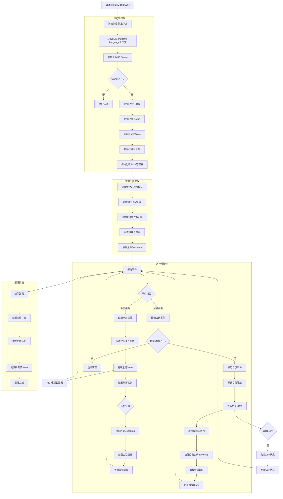

# GlobalSyncProvider 代码分析文档

## createGlobalSync 分析

### 程序执行流程图




### 主要模块说明

#### 1. 初始化阶段 (Initialization)

- **获取上下文**: 获取SDK、平台、语言等依赖
- **创建Store**: 初始化全局状态存储
- **创建缓存**: 设置各种缓存(Map结构)
- **创建队列**: 建立刷新队列管理系统
- **创建子管理器**: 管理目录级别的子Store


#### 2. 资源加载阶段 (Resource Loading)

- **加载缓存项目**: 从持久化存储读取项目列表
- **设置Effects**: 建立响应式副作用监听
- **事件监听**: 订阅全局SDK事件
- **清理准备**: 设置组件卸载时的清理逻辑


#### 3. 运行时操作 (Runtime Operations)

- **事件处理**:
  - 全局事件 → 更新全局状态
  - 目录事件 → 更新目录特定状态
- **队列处理**:
  - 异步执行bootstrap操作
  - 管理目录加载顺序
- **会话加载**:
  - 缓存优先，回退到网络请求
  - 权限过滤和数量限制


#### 4. 数据流方向

```text
用户操作/系统事件 → SDK事件监听器 → 事件分发 → 状态更新 → UI更新
                            ↓
                    队列管理异步操作
                            ↓
                    持久化缓存更新
```


#### 5. 关键异步操作流程

```text
loadSessions:
  检查缓存 → 命中 → 使用缓存数据
         ↓ 未命中
  网络请求 → 成功 → 更新缓存 → 更新Store
         ↓ 失败
  错误处理 → 用户提示
```


```text
bootstrapInstance:
  检查是否正在启动 → 是 → 等待现有promise
               ↓ 否
  锁定目录 → SDK调用 → 数据加载 → 更新Store → 释放锁
```


#### 6. 清理机制

- 组件卸载时自动清理所有资源
- 目录销毁时清理相关缓存
- 事件监听器的正确取消订阅