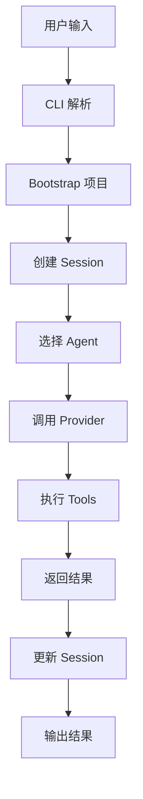
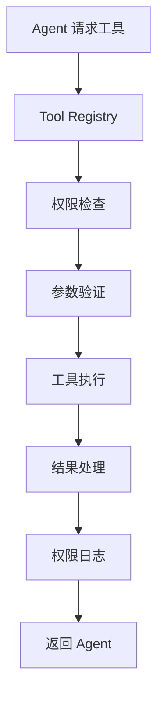
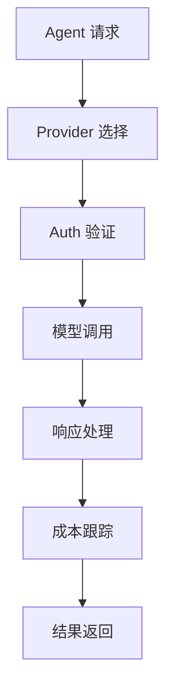
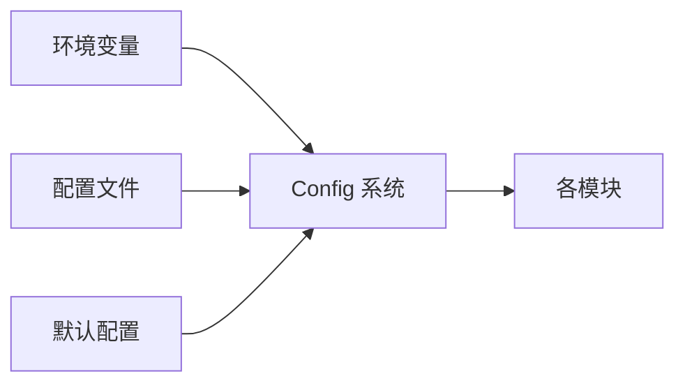
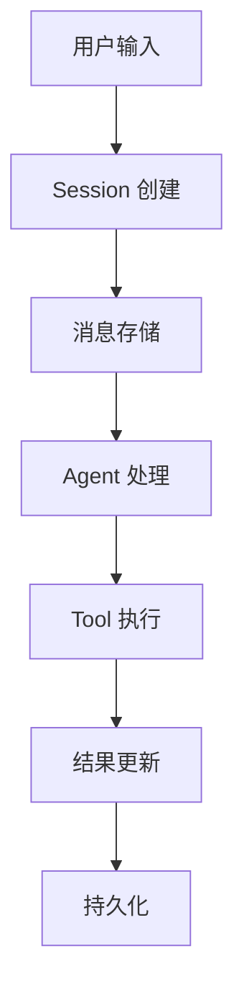

# 模块依赖关系与系统交互分析

## 概述

OpenCode 是一个复杂的系统，由多个相互依赖的模块组成。理解模块间的依赖关系和交互模式对于维护和扩展系统至关重要。本文档详细分析了模块间的依赖关系、数据流向和交互模式。

## 核心依赖图

### 依赖层次结构

```
Level 1 (基础设施)
├── global/          # 全局常量和配置
├── id/              # 唯一标识生成
├── util/            # 工具函数
├── env/             # 环境变量管理
└── flag/            # 功能开关

Level 2 (核心抽象)
├── storage/         # 存储抽象层
├── config/          # 配置管理
├── permission/      # 权限管理
├── auth/            # 身份认证
└── format/          # 格式化工具

Level 3 (系统核心)
├── project/         # 项目管理
├── session/         # 会话管理
├── agent/           # AI 代理
├── provider/        # AI 提供商
└── tool/            # 工具系统

Level 4 (用户界面)
├── cli/             # 命令行界面
├── server/          # Web 服务器
└── tui/             # 终端界面

Level 5 (高级功能)
├── plugin/          # 插件系统
├── scheduler/       # 调度器
├── share/           # 分享功能
└── skill/           # 技能系统
```

## 核心交互流程

### 1. 用户请求处理流程



**详细交互**:

1. **CLI** 接收用户命令
2. **Bootstrap** 初始化项目实例
3. **Session** 创建和管理会话状态
4. **Agent** 处理用户请求
5. **Provider** 调用 AI 服务
6. **Tool** 执行具体操作
7. **Storage** 持久化数据

### 2. 工具执行流程



**模块依赖**:

- **Agent** → **Tool Registry**: 获取可用工具
- **Tool Registry** → **Permission**: 权限验证
- **Tool** → **File System**: 文件操作
- **Tool** → **Bun**: 进程执行
- **Tool** → **Storage**: 数据存储

### 3. AI 提供商调用流程



**关键依赖**:

- **Agent** → **Provider**: 模型调用
- **Provider** → **Auth**: 身份认证
- **Provider** → **Network**: 网络通信
- **Provider** → **Config**: 配置管理

## 关键依赖关系

### 1. CLI 系统依赖

```typescript
// src/index.ts - 主要依赖
import { RunCommand } from "./cli/cmd/run" // CLI 命令
import { bootstrap } from "./cli/bootstrap" // 项目初始化
import { Server } from "./server/server" // Web 服务器
import { Provider } from "./provider/provider" // AI 提供商
import { Agent } from "./agent/agent" // AI 代理
```

**依赖链**:

```
CLI → Bootstrap → Project → Instance → Context
CLI → Command → Session → Agent → Provider → Tool
CLI → UI → Log → Format → Storage
```

### 2. Session 系统依赖

```typescript
// src/session/index.ts
import { Storage } from "../storage/storage" // 数据持久化
import { Instance } from "../project/instance" // 项目实例
import { MessageV2 } from "./message-v2" // 消息系统
import { Agent } from "../agent/agent" // 代理系统
import { PermissionNext } from "@/permission/next" // 权限控制
```

**关键依赖**:

- **Storage**: 会话数据持久化
- **Instance**: 项目上下文
- **Agent**: 代理执行
- **Permission**: 权限验证
- **Provider**: AI 模型调用

### 3. Tool 系统依赖

```typescript
// src/tool/registry.ts
import { Agent } from "../agent/agent" // 代理信息
import { Config } from "../config/config" // 配置管理
import { Plugin } from "../plugin" // 插件系统
import { PermissionNext } from "@/permission/next" // 权限控制
```

**依赖关系**:

- **Agent**: 工具配置和权限
- **Config**: 工具启用配置
- **Plugin**: 插件工具加载
- **Permission**: 工具执行权限

### 4. Agent 系统依赖

```typescript
// src/agent/agent.ts
import { Config } from "../config/config" // 配置管理
import { Provider } from "../provider/provider" // AI 提供商
import { SystemPrompt } from "../session/system" // 系统提示
import { PermissionNext } from "@/permission/next" // 权限规则
import { Plugin } from "@/plugin" // 插件代理
```

**核心依赖**:

- **Provider**: 模型调用接口
- **Session**: 提示和上下文
- **Permission**: 权限规则
- **Config**: 代理配置

## 数据流向分析

### 1. 配置数据流



**配置传播**:

1. **Env** → **Config**: 环境变量读取
2. **Config** → **各模块**: 配置分发
3. **Flag** → **各模块**: 功能开关控制

### 2. 会话数据流



**数据存储路径**:

```
Input → Session → Storage → Agent → Tools → Results → Storage
```

### 3. 权限数据流


## 接口耦合分析

### 1. 高耦合区域

#### Instance Context 系统

```typescript
// src/project/instance.ts
const context = Context.create<Context>("instance")
```

**影响范围**: 几乎所有模块都依赖 Instance Context
**耦合度**: 高
**原因**: 提供全局的项目上下文

#### Tool Registry

```typescript
// src/tool/registry.ts
export async function tools(model, agent)
```

**影响范围**: Agent、Session、Plugin
**耦合度**: 中高
**原因**: 核心工具注册和发现机制

### 2. 低耦合设计

#### Plugin 系统

```typescript
// src/plugin/index.ts
export const Plugin = {
  list: () => Promise<Plugin[]>,
  load: (id: string) => Promise<void>,
}
```

**耦合度**: 低
**设计优势**: 标准接口，动态加载

#### Protocol 支持 (LSP, MCP, ACP)

**耦合度**: 低
**设计优势**: 独立协议实现，标准接口

## 循环依赖分析

### 1. 潜在循环依赖

#### Agent ↔ Session

- **Agent** 需要创建和管理 Session
- **Session** 需要调用 Agent 处理消息

**解决方案**:

- 通过接口解耦
- 使用事件系统通信
- 分离创建和执行逻辑

#### Session ↔ Tool

- **Session** 调用 Tool 执行操作
- **Tool** 可能需要创建子 Session

**解决方案**:

- Tool 通过上下文获取 Session 信息
- 避免直接创建 Session

### 2. 依赖注入策略

```typescript
// 使用依赖注入避免循环依赖
export function createContext<T>(dependencies: T) {
  return {
    provide: <R>(fn: (deps: T) => R) => fn(dependencies),
    update: (updates: Partial<T>) => {
      /* 更新逻辑 */
    },
  }
}
```

## 性能影响分析

### 1. 启动性能

#### 冷启动路径

```
CLI → Bootstrap → Instance → Config → Module Loading
```

**优化策略**:

- 懒加载非核心模块
- 并行初始化独立模块
- 缓存初始化结果

#### 热启动路径

```
CLI → Cache Lookup → Direct Execution
```

### 2. 运行时性能

#### 关键路径性能

1. **Tool 执行**: 需要优化 I/O 操作
2. **Provider 调用**: 需要优化网络请求
3. **Session 查询**: 需要优化数据访问

#### 优化措施

- 连接池和缓存
- 异步操作并行化
- 数据预加载

## 扩展性分析

### 1. 水平扩展

#### 多实例支持

- 每个 Instance 独立的项目上下文
- 通过 Instance Registry 管理
- 支持并行项目处理

#### 多用户支持

- 基于 Session 的用户隔离
- 权限系统确保安全
- 资源配额管理

### 2. 垂直扩展

#### 新模块添加

- 遵循分层架构
- 通过标准接口集成
- 使用插件系统扩展

#### 新功能集成

- 基于事件系统通信
- 通过配置开关控制
- 保持向后兼容

## 最佳实践建议

### 1. 依赖管理

#### 最小化依赖

- 只导入必要的模块
- 避免传递依赖
- 使用接口抽象

#### 循环依赖预防

- 分层架构设计
- 依赖倒置原则
- 事件驱动通信

### 2. 接口设计

#### 稳定的核心接口

- 版本化 API
- 向后兼容保证
- 清晰的文档

#### 灵活的扩展接口

- 插件标准化
- 配置驱动
- 事件钩子

### 3. 性能优化

#### 延迟加载

- 按需加载模块
- 懒初始化组件
- 条件性导入

#### 缓存策略

- 结果缓存
- 连接复用
- 配置缓存

## 监控和调试

### 1. 依赖监控

#### 模块使用统计

```typescript
// 跟踪模块加载和使用
const moduleStats = {
  loadTime: number,
  memoryUsage: number,
  callCount: number,
  errorRate: number,
}
```

#### 依赖图可视化

- 自动生成依赖图
- 检测异常依赖
- 性能瓶颈分析

### 2. 调试工具

#### 追踪系统

- 请求链路追踪
- 跨模块调用追踪
- 性能热点分析

#### 诊断工具

- 模块健康检查
- 依赖冲突检测
- 配置验证工具

这种模块化的依赖设计确保了 OpenCode 系统的可维护性、可扩展性和高性能，同时为后续的功能增强提供了坚实的基础。
